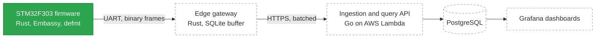

# embedded-rust


An end-to-end telemetry pipeline, built from the microcontroller up: async Rust
firmware on an STM32 board samples sensors and sends framed data over UART, a
Rust gateway on a home server buffers and uploads it, and a Go API on AWS Lambda
stores it in PostgreSQL. Infrastructure is managed with Terraform and deployed
through GitHub Actions.

The project is built in milestones. The firmware foundation is in place; the
remaining layers are planned and listed in the [roadmap](#roadmap).

## Architecture



Green is implemented. Dashed boxes are planned.

| Layer | Stack | Status |
|---|---|---|
| Firmware | Rust `no_std`, Embassy (async), defmt logging | In progress |
| Gateway | Rust, shares the firmware's protocol crate, SQLite buffer, systemd | Planned |
| Backend | Go, REST API, JWT auth, PostgreSQL | Planned |
| Infrastructure | AWS Lambda and API Gateway, Terraform | Planned |
| CI/CD | GitHub Actions: format, lint, and cross-compile the firmware | Done for firmware |
| Observability | Grafana Cloud, CloudWatch alarms | Planned |

## What the firmware does today

- Runs two async tasks on the Embassy executor: one blinks an LED, one waits for
  the user button.
- The button is interrupt-driven (EXTI), not polled. Each press cycles the blink
  interval through 500 ms, 200 ms, and 50 ms.
- The button task passes the new interval to the LED task through an
  `embassy_sync` `Signal`.
- Logs are sent to the host with defmt over RTT.

## Hardware

- Board: STM32F3 Discovery (MB1035, revision E)
- MCU: STM32F303VC, ARM Cortex-M4F, 256 KB flash, 40 KB RAM
- Debug probe: on-board ST-LINK

| Function | Pin |
|---|---|
| LED (LD3) | PE9 |
| User button | PA0 |

## Build and flash

Requirements:

- [rustup](https://rustup.rs). The toolchain, target (`thumbv7em-none-eabihf`),
  and components are pinned in `rust-toolchain.toml` and installed automatically.
- [probe-rs](https://probe.rs) for flashing and log output.

Connect the board through its ST-LINK USB port, then:

```sh
cargo run --release
```

This builds the firmware, flashes it, and prints the defmt logs:

```text
[INFO ] start (embedded_rust embedded-rust/src/main.rs:56)
[INFO ] button pressed (embedded_rust embedded-rust/src/main.rs:47)
[INFO ] blink delay changed: 200 ms (embedded_rust embedded-rust/src/main.rs:32)
[INFO ] button pressed (embedded_rust embedded-rust/src/main.rs:47)
[INFO ] blink delay changed: 50 ms (embedded_rust embedded-rust/src/main.rs:32)
```

To build without a board attached:

```sh
cargo build --release
```

The checks that CI runs can be run locally:

```sh
cargo fmt --check
cargo clippy --release -- -D warnings
```

## Roadmap

- [x] **M1** Firmware foundation: Embassy, defmt, LED and button tasks, CI
- [ ] **M2** Sensor drivers (I2C, SPI) and a versioned binary serial protocol
- [ ] **M3** Rust edge gateway with offline buffering and retry
- [ ] **M4** Go backend: ingestion and query API, JWT auth, PostgreSQL
- [ ] **M5** AWS infrastructure with Terraform and continuous deployment
- [ ] **M6** Observability and hardware-in-the-loop CI
- [ ] **M7** Documentation and demo
